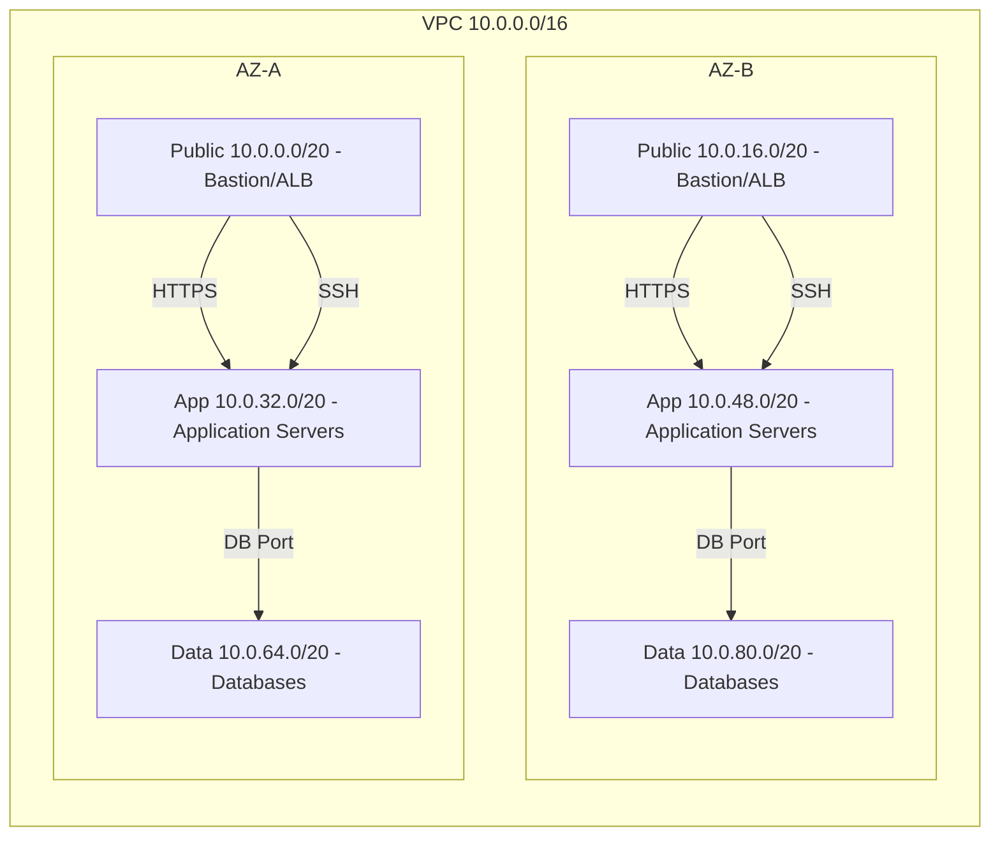

# Secure and Scalable Multi-Tier VPC Foundation

## Overview

The goal of this project is to design and build a production-grade network architecture in AWS that can host a three-tier web application. 

Key design goals:

- **Security:** Strong isolation between public, application, and data tiers using security groups and network ACLs.  
- **High Availability:** Two Availability Zones for redundancy of subnets and NAT gateways.  
- **Scalability:** VPC and subnets designed with ample CIDR space to support horizontal scaling.

References:

[NIST SP 800-53](https://csrc.nist.gov/pubs/sp/800/53/r5/upd1/final) - Security and Privacy Controls for Information Systems and Organizations

## Architecture

The network is designed using a multi-AZ, three-tier model. Public subnets provide controlled ingress to the VPC, while application and data tiers are isolated in private subnets.

### VPC

The VPC uses a /16 CIDR (10.0.0.0/16). This provides ample address space that can support horizontal scaling across multiple Availability Zones.

Associated with the VPC is an internet gateway, which allows resources in public subnets to reach the internet.

### Subnets

**Public Subnets**: Bastion hosts and ALBs, direct internet access, limited ingress.

**Application Subnets**: Private subnets hosting application servers. Accessible only from public subnets and bastion.

**Data Subnets**: Private subnets hosting databases. Only accessible from application subnets.

Each subnet uses a /20 CIDR block, which provides sufficient address space for growth while keeping the network manageable.

```
+--------+--------------+--------------+------------------------------------+
| Tier   | AZ-A CIDR    | AZ-B CIDR    | Description                        |
+--------+--------------+--------------+------------------------------------+
| Public | 10.0.0.0/20  | 10.0.16.0/20 | Bastion host, ALB, internet-facing|
+--------+--------------+--------------+------------------------------------+
| App    | 10.0.32.0/20 | 10.0.48.0/20 | Application servers (private)      |
+--------+--------------+--------------+------------------------------------+
| Data   | 10.0.64.0/20 | 10.0.80.0/20 | Database servers (private)         |
+--------+--------------+--------------+------------------------------------+
```

Below is an outline of the complete architecture:


## Security
NIST 800-53 was loosely used as a reference lens for network segmentation and access controls.

### Security Groups
All security groups follow least-privelege access:

```
+---------+-----------------------------------------+-------------------------------------------+
| Tier    | Ingress                                 | Egress                                    |
+---------+-----------------------------------------+-------------------------------------------+
| Bastion | SSH from admin IP only                  | All to 0.0.0.0/0                          |
+---------+-----------------------------------------+-------------------------------------------+
| Public  | HTTP/HTTPS from 0.0.0.0/0               | All to 0.0.0.0/0                          |
+---------+-----------------------------------------+-------------------------------------------+
| App     | HTTPS from public SG, SSH from bastion  | To data SG on DB port only; HTTPS to NAT  |
+---------+-----------------------------------------+-------------------------------------------+
| Data    | DB port from app SG only                | None                                      |
+---------+-----------------------------------------+-------------------------------------------+

```

### Network ACLs
Public and private NACLs provide stateless network controls, complementing security groups:

```
+---------+-----------+---------+-----------------+----------------+-------------------+
| NACL    | Rule #    | Type    | Protocol        | Port(s)        | CIDR              |
+---------+-----------+---------+-----------------+----------------+-------------------+
| Public  | 100       | Inbound | TCP             | 80 (HTTP)      | 0.0.0.0/0         |
| Public  | 110       | Inbound | TCP             | 443 (HTTPS)    | 0.0.0.0/0         |
| Public  | 120       | Inbound | TCP             | 22 (SSH)       | <ADMIN_IP_CIDR>   |
| Public  | 130       | Inbound | TCP             | 1024-65535     | 0.0.0.0/0         |
| Public  | 100       | Outbound| All (-1)        | All            | 0.0.0.0/0         |
+---------+-----------+---------+-----------------+----------------+-------------------+
| Private | 100       | Inbound | All (-1)        | All            | 10.0.0.0/16       |
| Private | 100       | Outbound| All (-1)        | All            | 0.0.0.0/0         |
+---------+-----------+---------+-----------------+----------------+-------------------+
```

## Usage Instructions
Assumes user is authenticated with AWS.

1. Create a vars.auto.tfvars file, and fill in the following variables:

admin_ip_cidr: The CIDR of the IP address space that can SSH into the bastion (Use your public IP address).

key_pair_name: Name of they ec2 key pair to use to SSH into the bastion instance.

```
admin_ip_cidr = "<YOUR_IP>"
key_pair_name = "<YOUR_KEYPAIR>"
```

2. Initialize terraform.
```
terraform init
```

3. View all resources being applied/destroyed.
```
terraform plan
```

4. Apply the terraform.
```
terraform apply
```