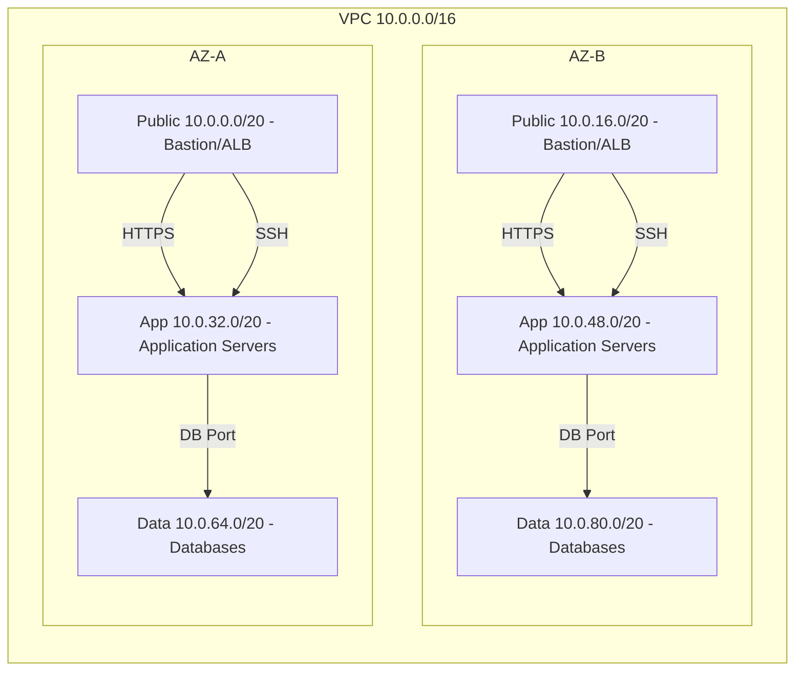

# Secure and Scalable Multi-Tier VPC Foundation

## Overview

The goal of this project is to design and build a production-grade network architecture in AWS that can host a three-tier web application. 

Key design goals:

- **Security:** Strong isolation between public, application, and data tiers using security groups and network ACLs.  
- **High Availability:** Two Availability Zones for redundancy of subnets and NAT gateways.  
- **Scalability:** VPC and subnets designed with ample CIDR space to support horizontal scaling.

## Architecture

The network is designed using a multi-AZ, three-tier model. Public subnets provide controlled ingress to the VPC, while application and data tiers are isolated in private subnets.

### VPC

The VPC uses a /16 CIDR (10.0.0.0/16). This provides ample address space that can support horizontal scaling across multiple Availability Zones.

Associated with the VPC is an internet gateway, which allows resources in public subnets to reach the internet.

### Public Subnets

Two public subnets are provisioned (one per Availability Zone) for any Internet-facing resources.

Each subnet uses a /20 CIDR block, which provides sufficient IP addresses for growth while keeping the network manageable.


TODO: architecture model


## Security

### Security Groups
```
+---------+-----------------------------------------+-------------------------------------------+
| Tier    | Ingress                                 | Egress                                    |
+---------+-----------------------------------------+-------------------------------------------+
| Bastion | SSH from admin IP only                  | All to 0.0.0.0/0                          |
+---------+-----------------------------------------+-------------------------------------------+
| Public  | HTTP/HTTPS from 0.0.0.0/0               | To app SG on 443 only                     |
+---------+-----------------------------------------+-------------------------------------------+
| App     | HTTPS from public SG, SSH from bastion  | To data SG on DB port only; HTTPS to NAT  |
+---------+-----------------------------------------+-------------------------------------------+
| Data    | DB port from app SG only                | None                                      |
+---------+-----------------------------------------+-------------------------------------------+

```

### Network ACLs

```
+---------+-----------+---------+-----------------+----------------+-------------------+
| NACL    | Rule #    | Type    | Protocol        | Port(s)        | CIDR              |
+---------+-----------+---------+-----------------+----------------+-------------------+
| Public  | 100       | Inbound | TCP             | 80 (HTTP)      | 0.0.0.0/0         |
| Public  | 110       | Inbound | TCP             | 443 (HTTPS)    | 0.0.0.0/0         |
| Public  | 120       | Inbound | TCP             | 22 (SSH)       | <ADMIN_IP_CIDR>   |
| Public  | 130       | Inbound | TCP             | 1024-65535     | 0.0.0.0/0         |
| Public  | 100       | Outbound| All (-1)        | All            | 0.0.0.0/0         |
+---------+-----------+---------+-----------------+----------------+-------------------+
| Private | 100       | Inbound | All (-1)        | All            | 10.0.0.0/16       |
| Private | 100       | Outbound| All (-1)        | All            | 0.0.0.0/0         |
+---------+-----------+---------+-----------------+----------------+-------------------+
```
