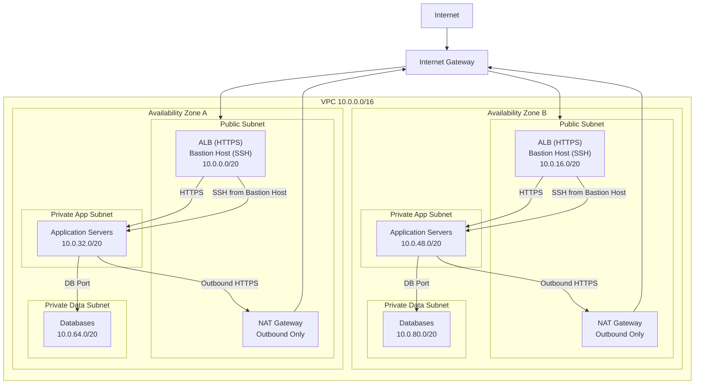

# Overview

The goal of this project is to design and build a secure, production-grade network architecture in AWS that can host a three-tier web application. 

Key design goals:

- **Security:** Strong isolation between public, application, and data tiers using security groups and network ACLs.  
- **High Availability:** Two Availability Zones for redundancy of subnets and NAT gateways.  
- **Scalability:** VPC and subnets designed with ample CIDR space to support horizontal scaling.

References:

[NIST SP 800-53](https://csrc.nist.gov/pubs/sp/800/53/r5/upd1/final) - Security and Privacy Controls for Information Systems and Organizations

# Architecture

The network is designed using a multi-AZ, three-tier model. Public subnets provide controlled ingress to the VPC, while application and data tiers are isolated in private subnets.

## VPC

The VPC uses a /16 CIDR (10.0.0.0/16). This provides ample address space that can support horizontal scaling across multiple Availability Zones.

Associated with the VPC is an **internet gateway**, which allows resources in public subnets to reach the internet.

## Subnets

**Public Subnets**: Bastion hosts and ALBs, direct internet access, limited ingress.

**Application Subnets**: Private subnets hosting application servers. Accessible only from public subnets and bastion.

**Data Subnets**: Private subnets hosting databases. Only accessible from application subnets.

Each subnet uses a /20 CIDR block, which provides sufficient address space for growth while keeping the network manageable.

```
+--------+--------------+--------------+------------------------------------+
| Tier   | AZ-A CIDR    | AZ-B CIDR    | Description                        |
+--------+--------------+--------------+------------------------------------+
| Public | 10.0.0.0/20  | 10.0.16.0/20 | Bastion host, ALB, internet-facing |
+--------+--------------+--------------+------------------------------------+
| App    | 10.0.32.0/20 | 10.0.48.0/20 | Application servers (private)      |
+--------+--------------+--------------+------------------------------------+
| Data   | 10.0.64.0/20 | 10.0.80.0/20 | Database servers (private)         |
+--------+--------------+--------------+------------------------------------+
```

## NAT Gateway

The NAT gateway provides outbound-only internet access for private subnets while preventing any inbound connectivity from the internet. This access is required for system updates and package installation. Ingress remains strictly controlled at all tiers through security groups and network ACLs.

**Important Note**: In a production environment, outbound access would be progressively restricted once traffic patterns are well understood.

## Diagram

Below is an outline of the complete architecture:


# Security
NIST SP 800-53 was used as a guiding reference for network segmentation and access control, with emphasis on least-privilege, tier isolation, and controlled trust boundaries. Refer to the *Security Groups* section for tier-specific access details.

## Security Groups
Below is a breakdown of all created security groups along with the rules applied to them.

### Bastion Security Group
----
#### Purpose:
Provide controlled administrative access to private instances without exposing them directly to the internet.

#### Rules:
**Ingress**
- SSH (22) from a single trusted admin CIDR

**Egress**
- All outbound traffic allowed

#### Rationale:
Ingress is tightly restricted to a known admin IP. Egress is intentionally unrestricted to allow the bastion to initiate management connections to internal resources. Actual access is still constrained by the target security groups.

---

### Public Security Group

#### Purpose:
Expose only web-facing services to the internet.

#### Rules:

**Ingress**
- HTTP (80) from anywhere
- HTTPS (443) from anywhere

**Egress**
- All outbound traffic allowed

#### Rationale:
This tier acts as the internet-facing boundary (e.g., ALB). It cannot directly access the data tier and can only reach the application tier on HTTPS.

---

### Application Security Group

#### Purpose:
Host application servers that process requests from the public tier and access backend data.

#### Rules:

**Ingress**
- HTTPS (443) from the public security group
- SSH (22) from the bastion security group

**Egress**
- Database port only to the data security group
- HTTPS (443) to `0.0.0.0/0` (via NAT Gateway)

#### Rationale:
This enforces strict least-privilege:
- The app tier can only receive traffic from known tiers
- It can only access the data tier on the database port
- Internet access is limited to HTTPS and must go through the NAT Gateway

---

### Data Security Group

#### Purpose:
Protect backend databases from unauthorized access.

#### Rules:

**Ingress**
- Database port from the application security group only

**Egress**
- None

#### Rationale:
The data tier is fully isolated:
- No direct internet access
- No administrative access
- Only accepts connections initiated by the app tier on the required port

Note: Because security groups are stateful, return traffic for allowed inbound connections is automatically permitted without requiring any defined egress rules.

### Table Summary

```
+---------+-----------------------------------------+-------------------------------------------+
| Tier    | Ingress                                 | Egress                                    |
+---------+-----------------------------------------+-------------------------------------------+
| Bastion | SSH from admin IP only                  | All to 0.0.0.0/0                          |
+---------+-----------------------------------------+-------------------------------------------+
| Public  | HTTP/HTTPS from 0.0.0.0/0               | All to 0.0.0.0/0                          |
+---------+-----------------------------------------+-------------------------------------------+
| App     | HTTPS from public SG, SSH from bastion  | To data SG on DB port only; HTTPS to NAT  |
+---------+-----------------------------------------+-------------------------------------------+
| Data    | DB port from app SG only                | None                                      |
+---------+-----------------------------------------+-------------------------------------------+

```

## Network ACLs
Network ACLs (NACLs) provide a stateless, subnet-level security guard-rail that complements the stateful instance-level controls that security groups provide.

### Public Subnet NACL

#### Purpose:
Control internet-facing traffic entering and leaving any public subnet(s).

#### Rules:

**Inbound**
- HTTP (80) from `0.0.0.0/0`
- HTTPS (443) from `0.0.0.0/0`
- SSH (22) from the trusted admin CIDR
- Ephemeral ports (1024–65535) from `0.0.0.0/0`

**Outbound**
- All traffic to `0.0.0.0/0`

#### Rationale:
Public subnets host internet-facing components such as bastion hosts and load balancers. Inbound rules are limited to required services only. Ephemeral ports are explicitly allowed due to the stateless nature of NACLs, ensuring return traffic is not blocked.

Outbound traffic is unrestricted to allow public resources to initiate responses and downstream connections, with actual access still constrained by security groups.

---

### Private Subnet NACL (Application and Data Tiers)

#### Purpose:
Provide a broad internal trust boundary for any private subnet(s) while preventing direct internet exposure.

#### Rules:

**Inbound**
- All traffic from within the VPC CIDR (`10.0.0.0/16`)

**Outbound**
- All traffic to `0.0.0.0/0`

#### Rationale:
Private subnets are not directly reachable from the internet. Instead of enforcing tier-specific controls at the NACL level, this design relies on security groups for precise, least-privilege enforcement between application and data tiers.

### Table Summary

```
+---------+-----------+---------+-----------------+----------------+-------------------+
| NACL    | Rule #    | Type    | Protocol        | Port(s)        | CIDR              |
+---------+-----------+---------+-----------------+----------------+-------------------+
| Public  | 100       | Inbound | TCP             | 80 (HTTP)      | 0.0.0.0/0         |
| Public  | 110       | Inbound | TCP             | 443 (HTTPS)    | 0.0.0.0/0         |
| Public  | 120       | Inbound | TCP             | 22 (SSH)       | <ADMIN_IP_CIDR>   |
| Public  | 130       | Inbound | TCP             | 1024-65535     | 0.0.0.0/0         |
| Public  | 100       | Outbound| All (-1)        | All            | 0.0.0.0/0         |
+---------+-----------+---------+-----------------+----------------+-------------------+
| Private | 100       | Inbound | All (-1)        | All            | 10.0.0.0/16       |
| Private | 100       | Outbound| All (-1)        | All            | 0.0.0.0/0         |
+---------+-----------+---------+-----------------+----------------+-------------------+
```

# Usage Instructions
Below are instructions to run the deployment, assuming authentication with AWS.

1. Create a vars.auto.tfvars file, and fill in the following variables:

    admin_ip_cidr: The CIDR of the IP address space that can SSH into the bastion (Use your public IP address).

    key_pair_name: Name of they ec2 key pair to use to SSH into the bastion instance.

    ```
    admin_ip_cidr = "<YOUR_IP>"
    key_pair_name = "<YOUR_KEYPAIR>"
    ```

2. Initialize terraform.
    ```
    terraform init
    ```

3. View all resources being applied/destroyed.
    ```
    terraform plan
    ```

4. Apply the terraform.
    ```
    terraform apply
    ```