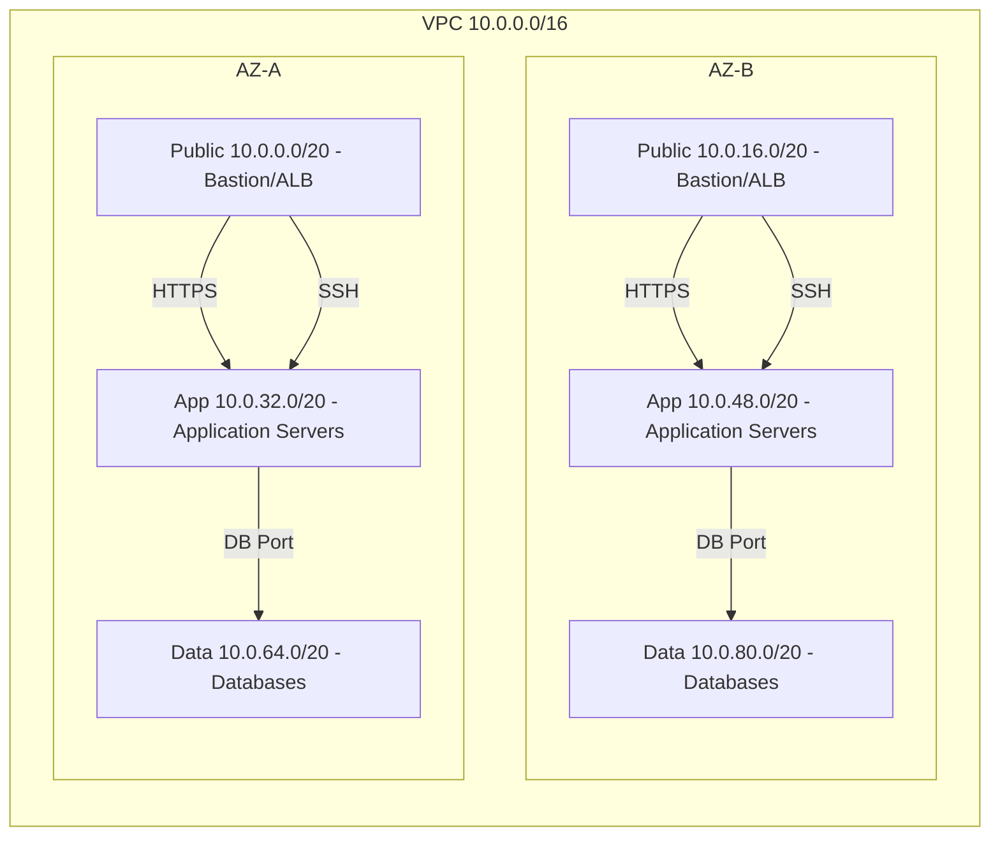

# Secure and Scalable Multi-Tier VPC Foundation

## Overview

The goal of this project is to design and build a production-grade network architecture in AWS that can host a three-tier web application. 

The architecture is designed to provide clear network segmentation between tiers, high availability, and a strong security baseline using least-privilege access controls.

## Architecture

The network is designed using a multi-AZ, three-tier model. Public subnets provide controlled ingress to the VPC, while application and data tiers are isolated in private subnets.

### VPC

The VPC uses a /16 CIDR (10.0.0.0/16). This provides ample address space that can support horizontal scaling across multiple Availability Zones.

Associated with the VPC is an internet gateway, which allows resources in public subnets to reach the internet.

### Public Subnets

Two public subnets are provisioned (one per Availability Zone) for any Internet-facing resources.

Each subnet uses a /20 CIDR block, which provides sufficient IP addresses for growth while keeping the network manageable.

TODO: architecture model

## Security

### Security Groups

### ACL